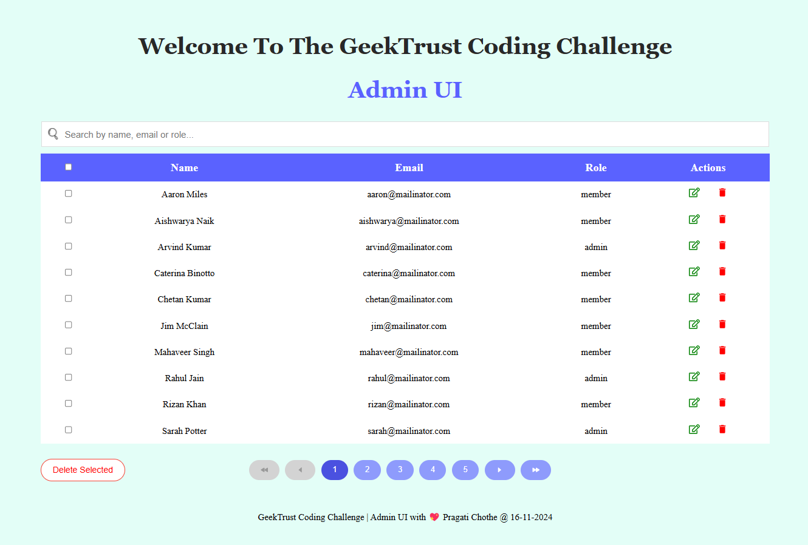
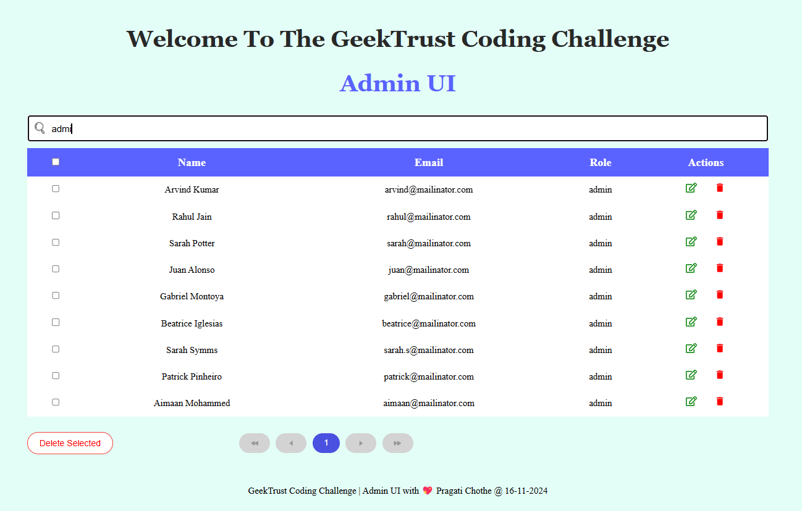
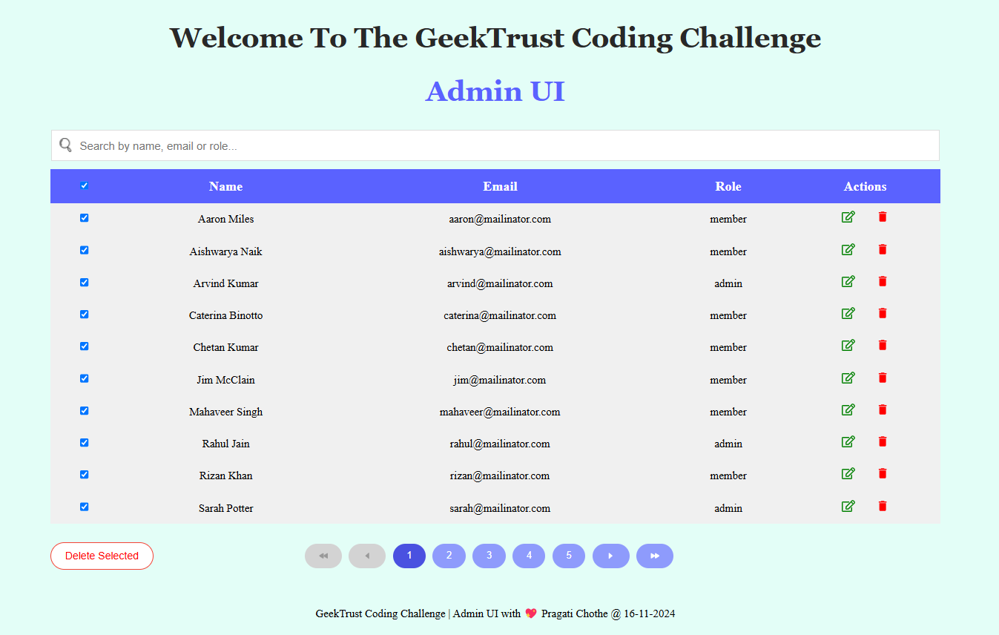
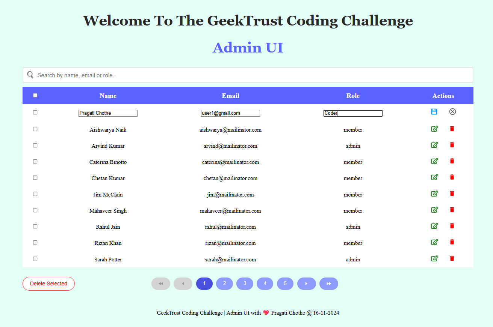
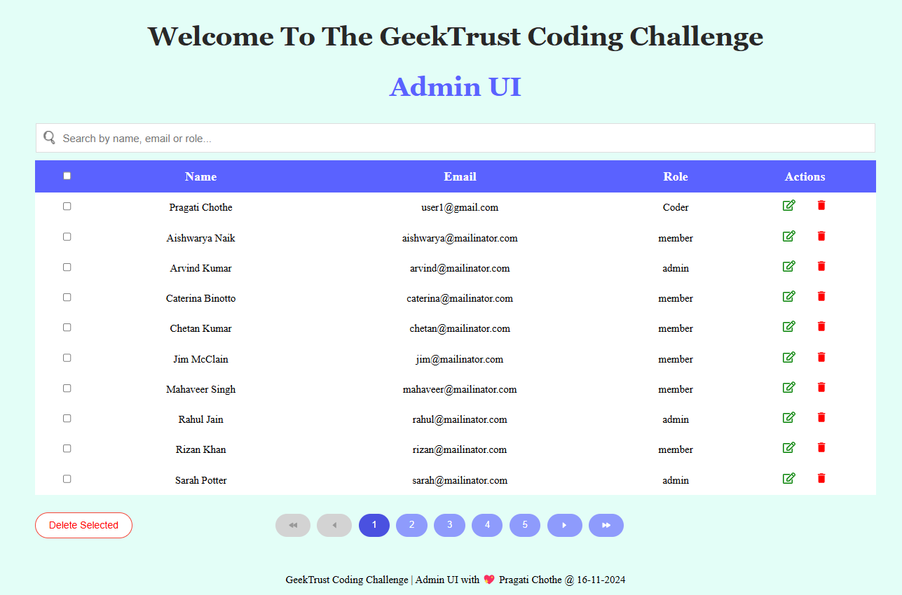

# Admin UI Solution

This repository contains a solution to the **GeekTrust Frontend Coding Challenge | Admin UI**. 

The application provides an interface for admins to view, edit, and delete user data fetched from an external API.


## **Challenge Description**

The task was to create a simple admin UI with the following requirements:

### **Features Required**

- **Table Display**:
   - Columns must stand out visually from the rows.

- **Search Functionality**:
   - A search bar to filter data by any property (e.g., name, email, role).

- **Edit and Delete**:
   - Edit and delete functionalities to manage data (in-memory changes only).

- **Pagination**:
   - Each page displays 10 rows.
   - Pagination buttons for navigating between pages (`First`, `Previous`, `Next`, `Last`).
   - Pagination adjusts dynamically based on search results.

- **Row Selection**:
   - Select one or multiple rows using checkboxes.
   - Delete multiple selected rows at once using a `Delete Selected` button.

- **Select/Deselect All**:
   - Checkbox in the header to select/deselect all rows on the current page.

- **Styling**:
   - Search bar placeholder should start with "Search".
   - Specific class names for search (`search-icon`), action buttons (`edit`, `delete`, `save`), and navigation buttons (`first-page`, `next-page`, etc.).
   - Avoid using third-party UI libraries (e.g., Material-UI, Bootstrap).


## **My Approach**

To build this solution, I broke the problem into smaller tasks and tackled them step by step. Below is a detailed breakdown of my process.

### **Step 1: Initial Setup**
    
- **Created a React app using Vite**:

   - Vite offers fast builds and a great developer experience.

   - Installed dependencies using:
     
        - `npm create vite@latest .`
        - package name: `admin-ui`
        - language: `React`
        - `npm install`
     
----

### **Step 2: Component Development**

- **Custom Hook (useTableData.jsx)**:
   - Created a `useTableData` hook to fetch user data from the API:  
     `https://geektrust.s3-ap-southeast-1.amazonaws.com/adminui-problem/members.json`.

- **Homepage**:
   - Designed a `HomePage` component as the main entry point for the app.

- **User Table Component**:
   - Built a table to display user data.
   - Highlighted column headers to differentiate them from rows.

- **Search Bar Component**:
   - Added a search bar at the top of the table to filter user data.

- **Pagination UI**:
   - Developed a pagination component with navigation buttons.

---

### **Step 3: Logic Implementation**

- **Pagination Logic**:
   
   The pagination ensures that only 10 rows are displayed per page. Buttons adjust dynamically based on the total number of filtered rows. Here’s a high-level algorithm for implementing pagination:

    1. **Divide Data into Pages**:
        - Calculate the total number of pages based on the filtered data and rows per page.
        - Maintain the current page in the state.
    2. **Navigation Logic**:
        - Handle navigation buttons (`First`, `Previous`, `Next`, `Last`) by updating the current page state.
        - Ensure bounds are respected (e.g., the first page cannot navigate backward).
    3. **Dynamic Rendering**:
        - Slice the data array to display rows corresponding to the current page.

        ```javascript
        const rowsPerPage = 10;

        // Calculate the number of pages
        const totalPages = Math.ceil(filteredItems.length / rowsPerPage);

        // Get rows for the current page
        const startIndex = (currentPage - 1) * rowsPerPage;
        const currentRows = filteredItems.slice(startIndex, startIndex + rowsPerPage);
        ```

- **Checkbox Functionality**:
   - Allowed selecting/deselecting individual rows.
   - Enabled "Select All" for the current page using the header checkbox.
   - Here’s a high-level algorithm for implementing Checkbox:

        ```javascript
        // Toggle select all for the current page
        const handleSelectAll = (e) => {
            const { checked } = e.target;

            // Get the IDs of the users visible on the current page
            const currentPageUserID = currentRows.map((user) => user.id);

            if (checked) {
            // Add only current page's user IDs to the selection
            setIsChecked((item) => [...new Set([...item, ...currentPageUserID])]);
            } else {
            // Remove current page's user IDs from the selection
            setIsChecked((item) =>
                item.filter((id) => !currentPageUserID.includes(id))
            );
            }
        };
        ```

-  **Edit, Save, and Delete**:
   
    - **Edit**: Allows rows to be edited directly in the table.
    - **Save**: Updates the table state with the edited values.
    - **Delete Selected**: Deletes all rows marked as selected.

        ```javascript
        // Edit functionality
        const startEditing = (user) => {
            setEditingId(user.id);
            setTempData({ ...user }); // Pre-fill the temporary data with current user data
        };

        // Save functionality
        const saveChanges = () => {
            const updatedUsers = users.map((user) =>
            user.id === editingId ? { ...user, ...tempData } : user
            );
            setUsers(updatedUsers); // Update the users state
            setEditingId(null); // Exit editing mode
        };

        // Delete selected rows
        const deleteUser = (userId) => {
            const usersAfterDeletion = users.filter((user) => {
            return user.id !== userId;
            });
            setUsers(usersAfterDeletion);
        };

        ```

---

### **Step 4: Header and Footer**
- Added a header and footer for a polished look and user-friendly navigation.


## **How to Get This Code Working**

1. **Clone the Repository**:
   ```bash
   git clone https://github.com/Pragati-C19/Admin-UI.git
   cd Admin-UI
   ```

2. **Install Dependencies**:
   ```bash
   npm install
   ```

3. **Start the Application**:
   ```bash
   npm start
   ```
    - Open your browser and navigate to the URL shown in the console (e.g., `http://localhost:3000`).


## **How to Test This Code**

- **Manual Testing**:
   - Open the application in your browser.
   - Test **search** by typing into the search bar.
   - Test **edit** by clicking the "Edit" button, modifying data, and saving it.
   - Test **delete** by clicking "Delete" for individual rows and using "Delete Selected" for multiple rows.
   - Test **pagination** by navigating between pages and verifying row counts.
   - Use the header checkbox to **select/deselect all rows** on the current page.

- **GeekTrust Requirements**:
   - Ensure the app meets all specified guidelines:
     - Proper placeholder text for the search bar.
     - Correct class names for buttons and actions.
     - Dynamic pagination and search functionality.

- **Automated Testing** (Optional):
   - Add tests using `React Testing Library` and `Jest`:
     - Test rendering of components.
     - Test API calls and state updates.


## **Screenshots**

### ***Homepage***


### ***Search Results***


### ***Checkbox Results***


### ***Edit Action***


### ***Save Edited Data***



## **Features Summary**
- Interactive table with edit, delete, and multi-row delete functionality.
- Search bar to filter users dynamically.
- Pagination with adjustable page counts.
- Header and footer for a complete application structure.


## **Future Improvements**
- Persist changes using a backend service or database.
- Add sorting functionality for columns.
- Improve UI/UX with animations and responsiveness.


## **Feedback**
If you have feedback or suggestions, feel free to create an issue or reach out to me via [LinkedIn](https://linkedin.com/in/pragati-c19).

Happy coding! 🚀
